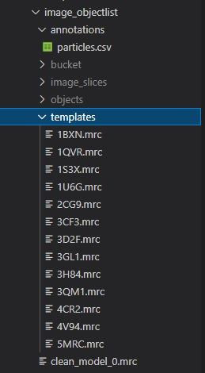
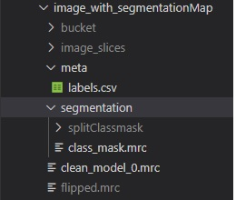

# Integrated Microscopy and Proteomics (IMP) Backend

This repository hosts the back end code for the Integrated Microscopy and Proteomics (IMP) Platform. Other repositories include the [Landing Page](https://github.com/DeMarcoLab/cryoglancerLandingPage) and the [Cryoglancer Application](https://github.com/DeMarcoLab/IMP/tree/main), which is a modified neuroglancer viewer.

The repository contains:
- files marked `deprecated_`
    - Deprecated code from previous iterations of the pipeline - this is kept for reference for reference for when this functionality is reimplemented and added to the existing system (files marked `deprecated_`)
- An `environment.yml` for the python environment that the pipeline uses
- A `Dockerfile` and `docker-compose.yml` that builds a container that processes incoming datasets
- expressjs
    - The backend for communicating with the Mongo database that stores the dataset metadata
    - This is a modified example project and so while this section does serve the service adequately at its current scale it is in need of restructure
- [multiresolution-mesh-creator](https://github.com/mitchellshargreaves-monash/multiresolution-mesh-creator/tree/4979288b4ca67ccd8b50a9b8865e747f9121f19e)
    - A submodule which the pipeline depends on
- nginx
    - An example NginX config and Docker for hosting datasets for the Cryoglancer viewer to access
- passthrough_api
    - An experiment which uses fast_api to pass through any commands to the docker container
    - Intended for use with a Relion Docker environment in the future to allow for users to upload just the tilt series rather than a full volume
- pipeline
    - The code used to process IMP datasets into something that can be viewed by the platform

# Archetecture
[Data flow](/images/data_flow.drawio.png)

# Pipeline

<!-- The pipeline takes in:
- A `metadata.json` config file
-  -->

Segmentation is also intended to be supported but has been temporarily deprecated as it is not used by the current version of [Cryoglancer](https://github.com/DeMarcoLab/cryoglancerLandingPage).

There are two pathways:

1) MRC file for the image available with a **list of molecules and their position/rotations.** Other values like cc can be in this table. If a .obj or .mrc image volume file is available for the individual molecules, it will be used to create duplicated objects at the correct position/rotation.
  
2) MRC file for the image, **as well as a class mask as MRC**. This will result in a segmentation layer for each type of class found in the file, with its individual object meshes calculated from the segmentation file. At the current stage, this does not support additional values like cc, and does not have the interactive functionalities like grouping, display meshes in an area etc. This can be used for viewing.

Both ways result in a folder of ...path.../bucket/dataset/
The contents of this folder will be hosted either locally on your computer for access with local neuroglancer, or on the web app for which the database has to be updated - It will be possible to do this step some time in the future.
  

<h4>OS Requirement</h4>
Linux, MAC.
WSL on Windows works, however you need to keep to the WSL file system when serving the files (and copying them to the server). Else the : in some file names will pose a problem on Windows.

<h4>Software Requirements</h4>

- The functions **mrc2tif** and **newstack** from ***[imod](https://bio3d.colorado.edu/imod/download.html)*** are used.
- Python 3 and Anaconda
- The required packages are bundled in the conda environment found in **environment.yml**

<h5>For object mesh creation</h5>
<a href="https://github.com/davidackerman/multiresolution-mesh-creator" target="_blank">Mesh creator</a>

<h5>For local server</h5>
A nginx config file to host on localhost is provided. The server has to be able to serve compressed files and overcome a few caveats with the filenames, therefore simplehttpserver wasn't sufficient. 
You can install nginx on linux with 

    apt-get install nginx

or on MAC:

    brew install nginx 
    
and add the config file at /etc/nginx/sites-available/ with a symlink to /etc/nginx/sites-enabled/. Edit the config file to point to the folder you want to serve. Use
  
    service nginx start
  
to start, restart if you made changes to the config file, and stop to stop. 
Note: This should only be used as long as you want to look at the files in your browser and stopped afterwards. Of course, other services will work as well, but have to be correctly configured, refer to the nginx config to get an idea of what is necessary.

<h5>Folder structure</h5>
Please look at the two examples to understand the required folder structure. The two images below also illustrate the structure.

**Pathway 1, image file with table of locations of particles as well as surface volume files**

- Place particles.csv in annotations folder: Table contains locations/rotations/name of particles. These have to match the mrc files in templates folder
- Templates folder: Add the available mrc files for particles here.
- Place the image mrc file on the parent folder. The greyed out folders will be created by the script and don't have to be present.
- Run the pipeline shell script with -p parameter pointing to the folder.
- The result will be put in bucket/dataset folder.

**Pathway 2, image file with classmask mrc present**

- In meta folder, you can specify a labels.csv file to give human readable names to the ids found in the classmask file.
- classmask file should be placed in segmentation folder and named such.
- Place the image mrc file on the parent folder. The greyed out folders will be created by the script and don't have to be present.
- Run the pipeline shell script with -p parameter pointing to the folder.
- The result will be put in bucket/dataset folder.

The content of the resulting folder is in the neuroglancer precomputed format. Our imp version of neuroglancer can read and process all the files in there when provided with the url to the folder, and will add interaction, however the raw image/segmentation/mesh data can be loaded into any neuroglancer instance  by serving it and then pointing to the URL at the source panel of the web app.

Please check the examples folder structure in this repository to understand where to put what for input.

<h5>To run</h5>

    bash ./pipeline.sh -p path/to/folder/containing/mrcFile
